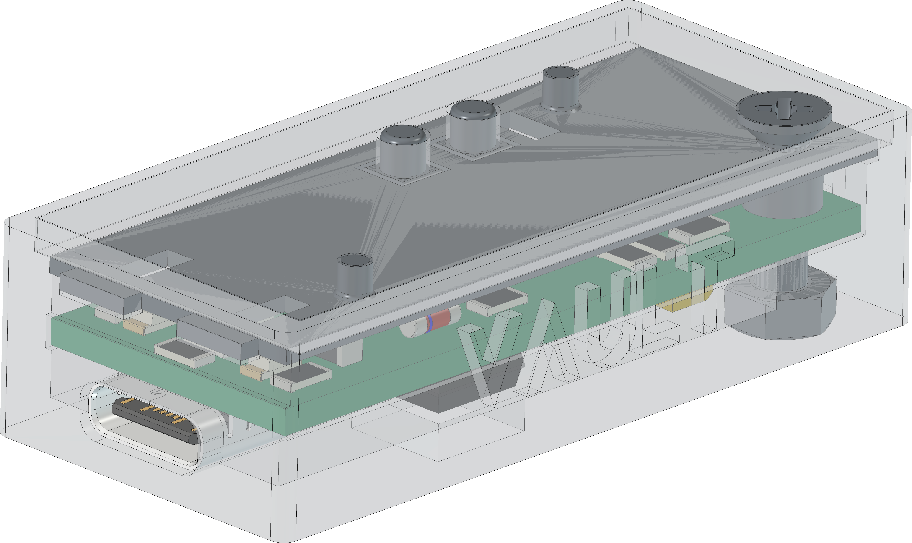
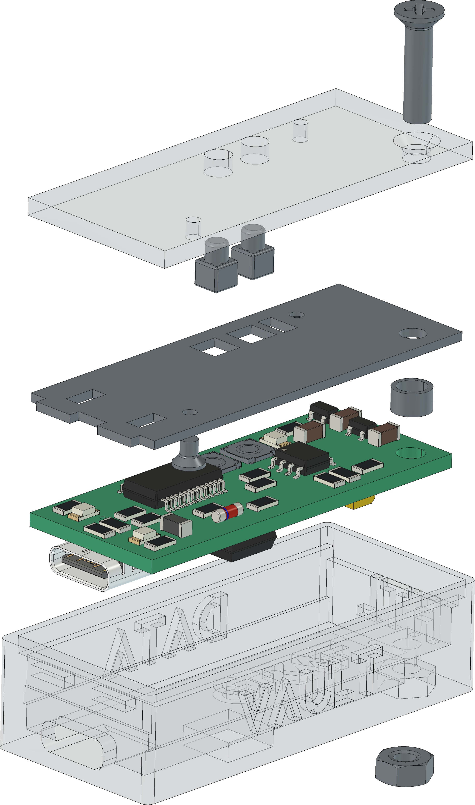

  

# `VLT` - Data Vault

The `VLT` is a board with an [RNG90](#additional-information) and a `TRNG` based on a digital circuit. It is possible to generate random numbers and print them over `UART`. The board itself is driven with `5V` over a `USBC` connector. The board itself can be programmed over `USB` and `avr-dude` (`serialupdi`). To programm the board over `USB` (`UART`) it is necessary to enable the `UPDI` programming function (over the onboard dip-switches). 

| Experience  | Level                                                                               |
|:------------|:-----------------------------------------------------------------------------------:|
| Soldering   |  |
| Mechanical  |     |

# Downloads

| Type      | File                                                                                                                                                 | Description     |
|:---------:|:----------------------------------------------------------------------------------------------------------------------------------------------------:|:----------------|
| Schematic | [pdf](https://github.com/0x007E/vlt/releases/latest/download/schematic.pdf) / [cadlab](https://cadlab.io/project/29805/main/files)                   | Schematic files |
| Board     | [pdf](https://github.com/0x007E/vlt/releases/latest/download/pcb.pdf) / [cadlab](https://cadlab.io/project/29805/main/files)                         | Board file      |
| Drill     | [pdf](https://github.com/0x007E/vlt/releases/latest/download/drill.pdf)                                                                              | Drill file      |
| BoM | [xlsx](https://github.com/0x007E/vlt/releases/latest/download/bom.xlsx) / [html](https://github.com/0x007E/vlt/releases/latest/download/bom.html)          | Bill of Material as Excel/interactive HTML |
| PCB    | [zip](https://github.com/0x007E/vlt/releases/latest/download/kicad.zip) / [tar](https://github.com/0x007E/vlt/releases/latest/download/kicad.tar.gz)    | KiCAD/Gerber/BoM/Drill files       |
| Mechanical | [zip](https://github.com/0x007E/vlt/releases/latest/download/freecad.zip) / [tar](https://github.com/0x007E/vlt/releases/latest/download/freecad.tar.gz) | FreeCAD/Housing and PCB (STEP/STL) files     |

# Hardware

The pcb is created with `KiCAD`, the housing with `FreeCAD`. All files are built with `github actions` so that they are ready for a production environment.

## PCB

The circuit board is populated on both sides (Top, Bottom). The best way for soldering the `SMD` components is within a vapor phase soldering system and for the `THT` components with a standard soldering system.

### Top Layer

### Bottom Layer

## Mechanical

The housing has a tolerance of `0.2mm` on each side of the case. So the pcb should fit perfectly in the housing. The tolerance can be modified with `FreeCAD` in the `Parameter` Spreadsheet.

### Assembled

### Exploded

# Additional Information

| Type       | Link               | Description              |
|:----------:|:------------------:|:-------------------------|
| FT232RL    | [pdf](https://ftdichip.com/wp-content/uploads/2020/08/DS_FT232R.pdf) | USB Full Speed to Serial UART IC, Includes Oscillator and EEPROM |
| RNG90      | [pdf](https://ww1.microchip.com/downloads/aemDocuments/documents/SCBU/ProductDocuments/DataSheets/RNG90-CryptoAuthentication-Data-Sheet-DS40002499.pdf) | RNG90 CryptoAuthentication |

---
